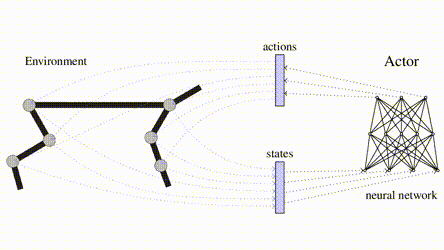

# DDRL
Deep Developmental Reinforcement Learning

This source code is still in a research state, it has been used during 
my PhD thesis to develop several deep reinforcement learning agent in continuous environments (both in state and action).


It contains : 
- 4 open-source and free environments using ODE (open dynamic engine) based on OpenAI/mujuco : acrobot, cartpole, half-cheetah and humanoid. We propose those environments because the free licence of Mujoco is not enough to perform hyperparameter meta-optimization on a cluster. However a lot of deep RL algorithms relies on a large number of hyperparameters.

- an implementation of DDPG with Caffe
```
Lillicrap, T. P., Hunt, J. J., Pritzel, A., Heess, N., Erez, T., Tassa, Y., … Wierstra, D. (2015). Continuous control with deep reinforcement learning. arXiv Preprint arXiv:1509.02971.
```
- an implementation of NFAC(&lambda;)-V (extended with eligibility traces)
```
Matthieu Zimmer, Yann Boniface, and Alain Dutech. Neural fitted actor-critic. In ESANN – European Symposium on Artificial Neural Networks, Computational Intelligence and Machine Learning, April 2016.

Matthieu Zimmer. Developmental reinforcement learning. PhD thesis, University of Lorraine, January 2018.
```

- an implementation of developmental layers for NFAC(&lambda;)-V and DDPG
```
Matthieu Zimmer, Yann Boniface, and Alain Dutech. Developmental Reinforcement Learning through Sensorimotor Space Enlargement. Developmental reinforcement learning through sensorimotor space enlargement. In The 8th Joint IEEE International Conference on Development and Learning and on Epigenetic Robotics, September 2018.
```

- an implementation of CMA-ES with Caffe
```
Auger, A., & Hansen, N. (2005). A restart CMA evolution strategy with increasing population size. In Evolutionary Computation, 2005. The 2005 IEEE Congress on (Vol. 2, pp. 1769–1776).
```
- an synchronized and simplified implementation of A3C
```
Mnih, V., Badia, A. P., Mirza, M., Graves, A., Lillicrap, T., Harley, T., … Kavukcuoglu, K. (2016). Asynchronous methods for deep reinforcement learning. In International Conference on Machine Learning (pp. 1928–1937).
```
- an implementation of CACLA
```
Van Hasselt, H., & Wiering, M. A. (2007). Reinforcement learning in continuous action spaces. In Proceedings of the IEEE Symposium on Approximate Dynamic Programming and Reinforcement Learning (pp. 272–279). http://doi.org/10.1109/ADPRL.2007.368199
```
- an implementation of DPG (Determinist Policy Gradient)
```
Silver, D., Lever, G., Heess, N., Degris, T., Wierstra, D., & Riedmiller, M. (2014). Deterministic Policy Gradient Algorithms. Proceedings of the 31st International Conference on Machine Learning (ICML-14), 387–395.
```
- an implementation of SPG (Stochastic Policy Gradient)
```
Sutton, R. S., Mcallester, D., Singh, S., & Mansour, Y. (1999). Policy Gradient Methods for Reinforcement Learning with Function Approximation. In Advances in Neural Information Processing Systems 12, 1057–1063. http://doi.org/10.1.1.37.9714
```
- an implementation of Elastic Weight Constraint for Caffe
```
Kirkpatrick, J., Pascanu, R., Rabinowitz, N., Veness, J., Desjardins, G., Rusu, A. A., ... & Hassabis, D. (2017). Overcoming catastrophic forgetting in neural networks. Proceedings of the National Academy of Sciences, 114(13), 3521-3526.
```
- an implementation of inverting gradient strategy
```
Hausknecht, Matthew, and Peter Stone. "Deep reinforcement learning in parameterized action space." arXiv preprint arXiv:1511.04143 (2015).
```

Everything has been developed in C++.
The neural network library used is Caffe.

[](https://www.youtube.com/watch?v=EzBmQsiUWBo)

## Install

Main dependencies : boost (>=1.54), caffe, ode(>=0.14).
However, it needs a modified version of Caffe : https://github.com/matthieu637/caffe.git
RAM+SWAP > 750 MB

### Archlinux
```
yaourt -Sy boost ode openblas-lapack hdf5 protobuf google-glog gflags leveldb snappy lmdb cuda xz cmake gtest freeimage
cd any_directory_you_want
git clone https://github.com/matthieu637/ddrl
mkdir caffe_compilation 
cd caffe_compilation
cp ../ddrl/scripts/extern/PKGBUILD-CAFFE-CPU PKGBUILD
makepkg
sudo pacman -U caffe-ddrl-git-1-x86_64.pkg.tar.xz
cd ../ddrl/
./fullBuild.bash
```

### Ubuntu >= 14.04

```
sudo apt-get update
#base
sudo apt-get install git libtool libboost-serialization-dev libboost-thread-dev libboost-system-dev libboost-program-options-dev libboost-filesystem-dev libtbb-dev libglew-dev python cmake libgtest-dev automake unzip libfreeimage-dev
#caffe
sudo apt-get install nvidia-cuda-dev nvidia-cuda-toolkit libprotobuf-dev libleveldb-dev libsnappy-dev protobuf-compiler libopenblas-dev libgflags-dev libgoogle-glog-dev liblmdb-dev libhdf5-serial-dev
#optional for developer
sudo apt-get install astyle cppcheck doxygen valgrind htop

cd any_directory_you_want
# gtest compilation
mkdir gtest
cp -r /usr/src/gtest/* gtest
cd gtest
cmake .
make -j4
sudo cp libgtest* /usr/lib/
cd ..

# caffe compilation
git clone https://github.com/matthieu637/caffe.git
mkdir caffe/build
cd caffe/build
cmake ../ -DBLAS=Open -DBUILD_python=OFF -DUSE_OPENCV=OFF -DCPU_ONLY=On -DCMAKE_INSTALL_PREFIX:PATH=/usr/local/
make -j4
sudo make install
cd ../..

# ode compilation needed if official packages is under 0.14
mkdir ode
cd ode
wget https://bitbucket.org/odedevs/ode/downloads/ode-0.14.tar.gz
tar -xf ode-0.14.tar.gz
cd ode-0.14
./bootstrap
CFLAGS=-O2 CPPFLAGS=-O2 ./configure --prefix=/usr/local --enable-shared --enable-libccd --enable-double-precision --disable-asserts --disable-demos --with-drawstuff=none
make -j4
sudo make install
cd ../..

# then you can finnaly compile ddrl
git clone https://github.com/matthieu637/ddrl
cd ddrl
./fullBuild.bash

```

### Mac
```
#if you run a version lower than sierra (example on mavericks)
#you need to install an up-to-date llvm version for c++11 features with :
#brew tap homebrew/versions
#brew install llvm38

#install brew
brew update
brew install cmake libtool findutils coreutils boost protobuf homebrew/science/hdf5 snappy leveldb gflags glog szip tbb lmdb gnu-sed
brew install --with-double-precision --with-shared ode

#caffe compilation
cd any_directory_you_want
git clone https://github.com/matthieu637/caffe.git
mkdir caffe/build
cd caffe/build
cmake ../ -DBLAS=Open -DBUILD_python=OFF -DUSE_OPENCV=OFF -DCPU_ONLY=On -DCMAKE_INSTALL_PREFIX:PATH=/usr/local/
make -j4
sudo make install
cd ../..

# then you can compile ddrl
git clone https://github.com/matthieu637/ddrl
cd ddrl
#if you want to use make to compile 
./fullBuild.bash
#or if you want to use Xcode projects
./fullBuild.bash xcode
```

### no access to sudo
if you don't have access to sudo, you can adapt the script under scripts/nosudo-install


## Usage

A .ini file is needed to describe the experience you want to run (neural network architecture, episodes, etc.).
```
#run the humanoid envionment with CMA-ES (debug version)
cd agent/cmaes/build/debug/
./humanoid --config cmaes-humanoid.ini

#run the humanoid environment with CMA-ES (release version with Xcode)
cd agent/cmaes/build/release/Release/
./humanoid --config ../cmaes-humanoid.ini

#run the humanoid envionment with CMA-ES (debug version + view)
cd agent/cmaes/build/debug/
./humanoid --config cmaes-humanoid.ini --view
```

The view option doesn't work on Mac because the GLUT thread need to be the main thread.

## Optimizing hyperparameters

See https://github.com/matthieu637/lhpo
